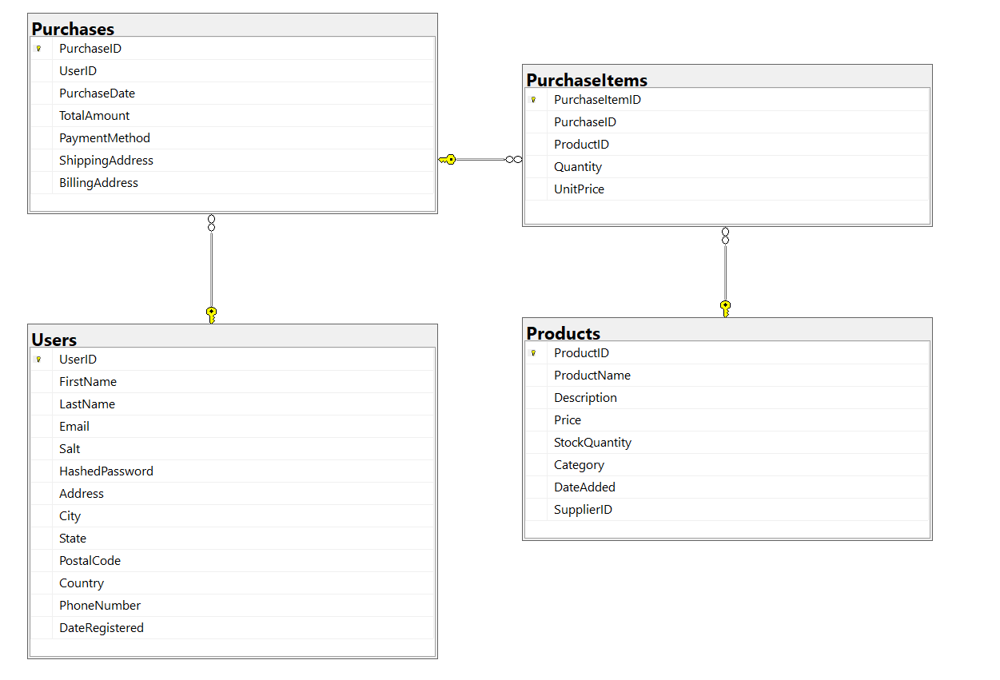
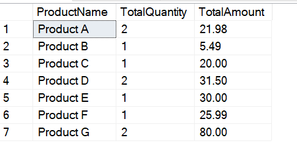
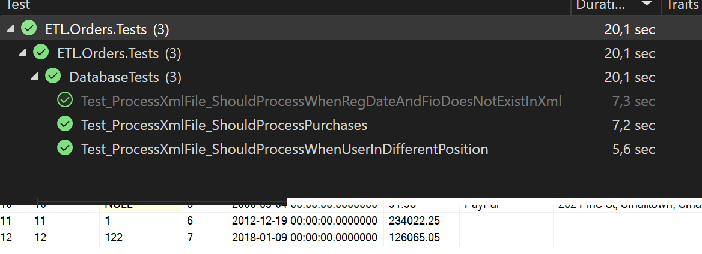

# ETL.Orders

1. Нарисовать схему базы данных. 
Предложите схему базы данных для интернет-магазина. База данных должна содержать следующие 3 сущности: Товары, Пользователи, Покупки товаров пользователями. Количество и состав таблиц на ваше усмотрение. На схеме должны быть колонки таблицы и связи между таблицами. Типы колонок указывать не нужно. Схема может быть создана в любом редакторе, либо от руки на листочке и сфотографирована.



2. Запрос к базе данных, схема которой была создана в первом пункте. 
Отделу продаж нужны сводные данные: перечень товаров, проданных в определенный день(например 1 сентября 2000 года). 
Нужны следующие поля: Наименование товара, количество проданных товаров и сумма на которую продали данный товар. 
Наименования товара не должны повторяться, нужны только сводные данные.

```sql
SELECT
    p.ProductName,
    SUM(pi.Quantity) AS TotalQuantity,
    SUM(pi.Quantity * pi.UnitPrice) AS TotalAmount
FROM
    dbo.PurchaseItems pi
    INNER JOIN dbo.Purchases pu ON pi.PurchaseID = pu.PurchaseID
    INNER JOIN dbo.Products p ON pi.ProductID = p.ProductID
WHERE
    pu.PurchaseDate >= '2000-09-01' AND pu.PurchaseDate < '2000-09-02'
GROUP BY
    p.ProductName
ORDER BY
    p.ProductName;
```



3. Загрузка информации из внешней системы
Необходимо написать консольную программу на С#. 
Программа должна загружать данные о покупках из XML файла, полученного из внешнего источника, в базу данных созданную вами в первом пункте

Пример XML файла:

```xml
<orders>
    <order>
        <no>1</no>
        <reg_date>2012.12.19</reg_date>
        <sum>234022.25</sum>
        <product>
            <quantity>2</quantity>
            <name>LG 1755</name>
            <price>12000.75</price>
        </product>
        <product>
            <quantity>5</quantity>
            <name>Xiomi 12X</name>
            <price>42000.75</price>
        </product>
        <product>
            <quantity>10</quantity>
            <name>Noname 14232</name>
            <price>1.7</price>
        </product>
        <user>
            <fio>Иванов Иван Иванович</fio>
            <email>abc@email.com</email>
        </user>
    </order>
    <order>
        <no>122</no>
        <reg_date>2018.01.09</reg_date>
        <sum>126065.05</sum>
        <product>
            <quantity>3</quantity>
            <name>Xiomi 12X</name>
            <price>42000.75</price>
        </product>
        <product>
            <quantity>20</quantity>
            <name>Noname 222</name>
            <price>3.14</price>
        </product>
        <user>
            <fio>Петров Виктор Семенович</fio>
            <email>xyz@email.com</email>
        </user>
    </order>
</orders>
```


1) файлы небольшие и полностью влазят в память

2) имя товара уникальное

3) email обязательный и уникальный

4) XML стандартный, те элементы могут отсутствовать и порядок элементов не гарантирован


